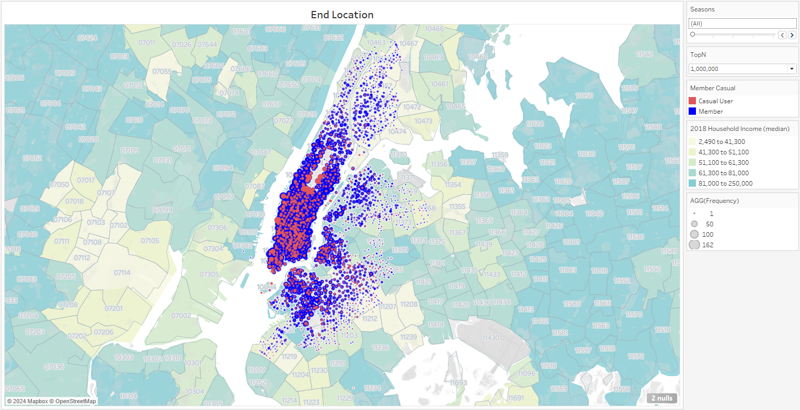
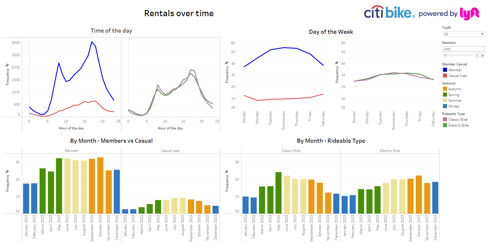
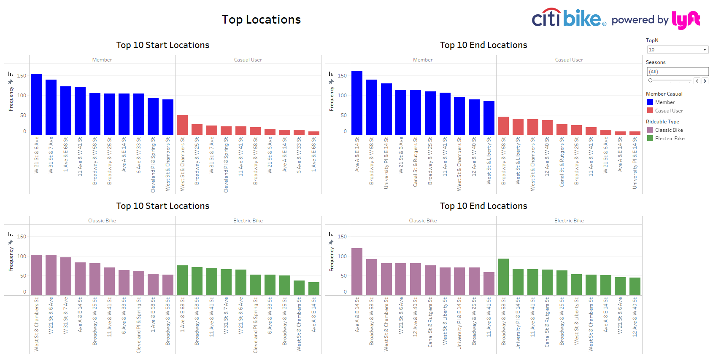

# tableau_challenge

Citi Bike is a privately owned public bicycle sharing system serving the New York City boroughs of the Bronx, Brooklyn, Manhattan, and Queens, as well as Jersey City and Hoboken, New Jersey.

In this project, data was extracted from the [Citi Bike Trip Histories](https://citibikenyc.com/system-data). To provide a full analysis, last year data was extrated (2023). Since Tableau Public has a data limit, a python program was developed to extract sample data from the CSV files. Refer to [combine_samples_csv.py](tableau_challenge/combine_samples_csv.py)

Afterwards, a Tableau Story was built to show the results of the Exploratory data analysis.  To see the results, please go to my [Tableau Public Story.](https://public.tableau.com/views/NY_Citi_Bike_17253349302610/Citybike2023Analysis?:language=en-US&publish=yes&:sid=&:redirect=auth&:display_count=n&:origin=viz_share_linkhttps:/)

As a preview, here are some screenshots:

#### Start Location Map

End Location Map

#### Rentals over time

#### Top Locations

